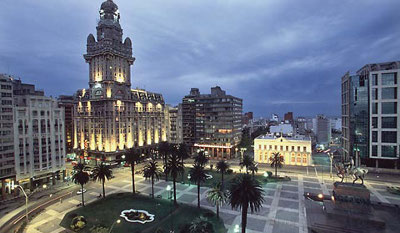

<h2>
    About me
</h2>

Hi! I'm Alvaro. I live currently in Berlin, Germany.

    

I was born in [Montevideo, Uruguay](https://en.wikipedia.org/wiki/Montevideo),
where I lived until the age of 27. It's a beautiful city, if you are in Buenos
Aires or around, I recommend you give it a visit.

    

My main interest is Web Development, that's what I work with and what I do in
my free time. All the software I write in my spare time is
[Free as in Freedom](https://en.wikipedia.org/wiki/Free_software). Check it out
in my [github account](https://github.com/tooxie).

<h3>
    Technologies
</h3>

The main languages I work with are Python and JavaScript. I'm always open to
learn about new technologies, but don't even ask me to write PHP if you want
me to take you seriously.

I still have pending some things I would like to learn, like C++ and some pure
functional language, like Haskell. If you have some idea or job offer that
would require me to learn any of these, go ahead and contact me.

<h3>
    Let's talk business
</h3>

Do you have an interesting offer for me? I'm always open to talk. Just drop me
an e-mail to <i>alvaro@mourino.net</i> and let's talk.

<!-- vim:filetype=markdown
-->
